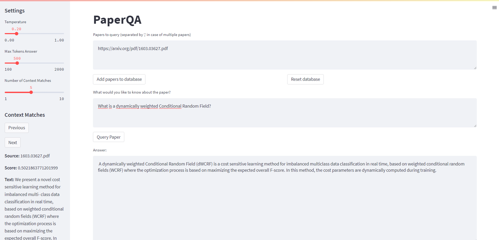

# PaperQA
This is an exemplary project for a Streamlit web app that runs a Haystack Question Answering Pipeline 
for Arxiv papers using OpenAI. The purpose of this app is to demonstrate how information retrieval based on a 
defined document database can be done. Additionally, it provides an example of how a Dockerized application can 
be easily deployed on AWS, including authentication and a custom domain using Terraform. For business inquiries, 
please send an email to [ekohlmeyer21@gmail.com](mailto:ekohlmeyer21@gmail.com).



## How it works
### Initial Settings
The configuration file can be found under `src/config.yaml`. The available settings can be found in `paperqa/settings.py`.

### Add Papers to Database
To add Arxiv papers to your database, please insert a comma-separated string of PDF URLs into the upper text area. 
Once you click on the "Add papers to database" button, a FAISS vector database will be created 
using the specified embedding model.

### Reset Database
To reset your database, simply click on "Reset database". This will remove all your downloaded papers 
as well as the FAISS database.

### Query Paper
Type your question into the text area above the "Query paper" button. 
Once you click the button, matching context will be retrieved from your vector database, 
and your question will be answered based on the retrieved context.

### Adjust Settings
Feel free to adjust the following settings in the left side bar:
* `Temperature`: How deterministic should the model's answer be? (Low temperature = more deterministic, high temperature = less deterministic)
* `Max Tokens Answer`: How many tokens should the model generate in your answer? (Keep in mind the max tokens limitations of the model used)
* `Number of Context Matches`: How many context matches should be used to answer your question? (Keep in mind the max tokens limitations of the model used)

You also have the option to skip through the context to see what the model's answer is referring to. 
The score shows the similarity between the question and the retrieved context information. 
The higher the score, the better the match.

## Build & Run the Application
To build the image, run the following command:
```bash
docker build -t paperqa .
```

For running the container locally, you will need to set some environment variables. 
The deployment of the app in AWS ECS handles the environment independently.

### Linux / MacOS:
```bash
docker run -p 8501:8501 -it \
-e OPENAI_API_KEY=$OPENAI_API_KEY \
paperqa 
```

### Windows:
```shell
docker run -p 8501:8501 -it `
-e OPENAI_API_KEY=$env:OPENAI_API_KEY `
paperqa 
```

The app is available at http://localhost:8501/ 

## TODO

To improve the quality of the answers based on the retrieved information, the following adjustments can be made:
* Filter for files/papers in the document database to include in the information retrieval.
* Set a minimum context similarity score to ensure high-quality retrieval results.
* Output a model probability to get a sense of how deterministic the answer is.
* Perform sanity checks to ensure the generated text is verbatim in the documents and was not hallucinated.